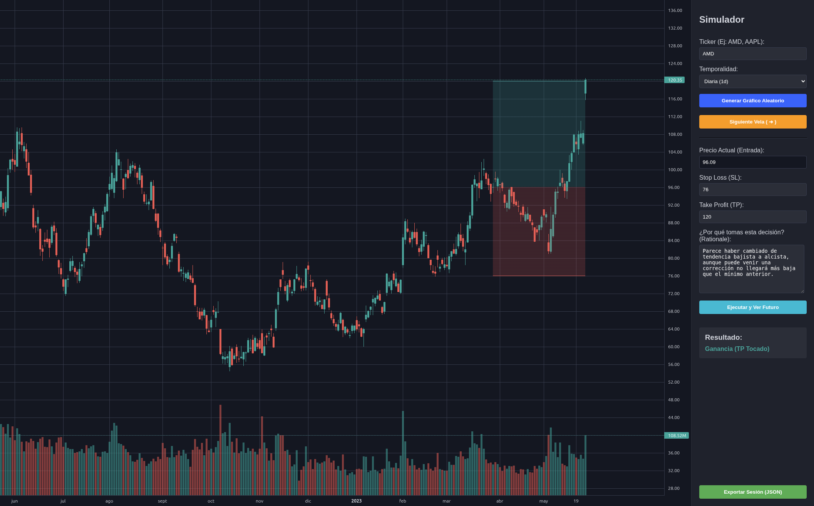

# Simulador de bolsa
   

Puedes practicar análisis técnico a saco (nada de indicadores) sin parar. Caso tras caso. Antes de redactar describe por qué crees en esos stop loss y take profits para que luego puedas contrastar lo que ha pasado. Si no entiendes por qué paso eso puedes exportarlo a JSON y pasárselo a una IA para que te lo explique.

### Despliegue
1. Crear el entorno: `python3 -m venv bolsa_venv`
2. Activar el entorno: `source mi_entorno/bin/activate`
3. Instalar librerías: `pip install -r requirements.txt`
4. Lanzar la app: `python3 app.py`
